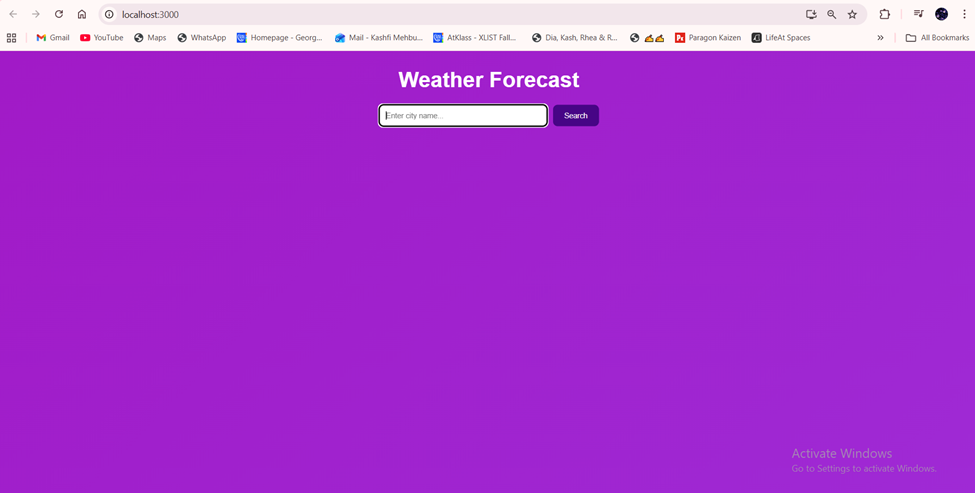
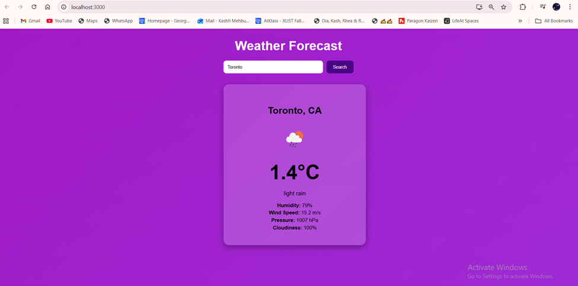
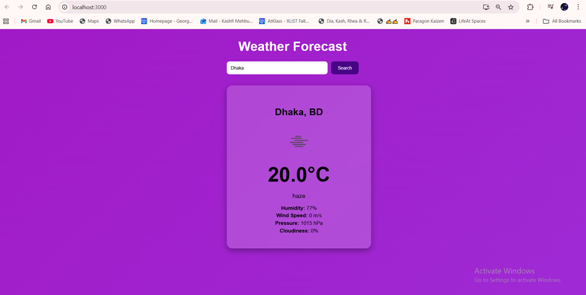
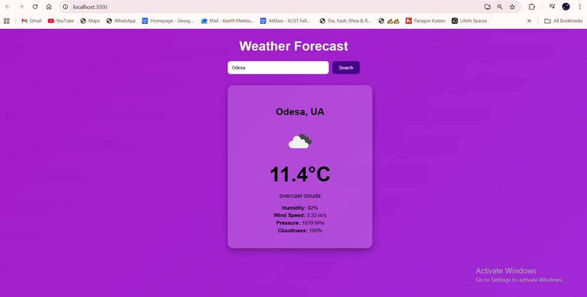
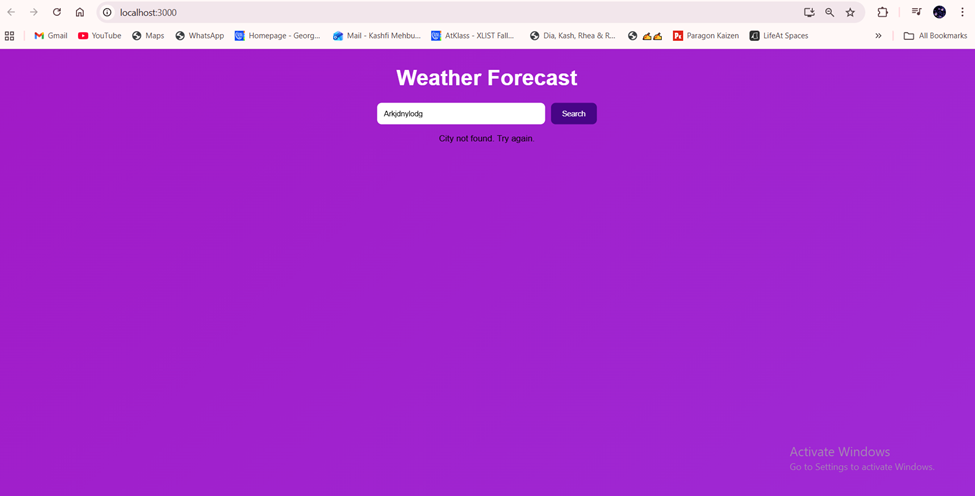

Comp3123 Lab Test 2

Vercel Link: https://101474002-comp3123-labtest2.vercel.app/

Student Name: Kashfi Mehbuba
Student ID: 101474002

This is a simple React weather application that allows users to search for any city and view the current weather conditions. The app displays temperature (°C), weather description, icon, humidity, wind speed, pressure, and cloudiness.
Weather data is fetched in real-time from the OpenWeatherMap API.

API Used -
OpenWeatherMap – Current Weather API: https://api.openweathermap.org/data/2.5/weather

Screenshots of my App:

When you launch the app:

Toronto Weather:

Dhaka Weather:

Odesa Weather:

Invalid Input:

